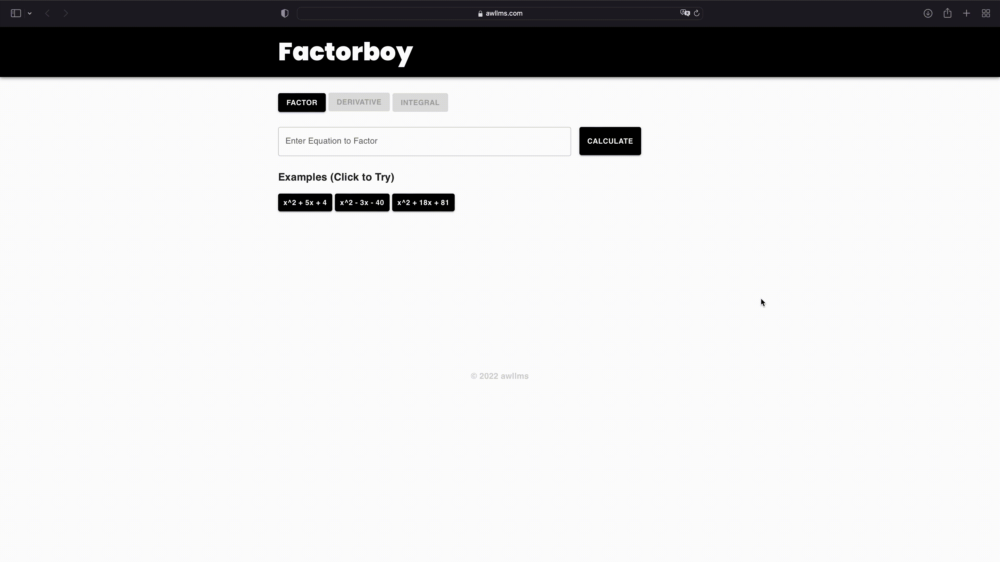

# Snap Inc Projects

This repo is a collection of projects I worked on at Snap Inc. as a Snap Engineering Scholar.

##  Bonsai Malibu - (Small Business Website)
This website is an unofficial demo website for a small business located in Malibu, CA.

## Demo

repo: https://github.com/awllms/bonsaimalibu  
website: https://awllms.com/bonsaimalibu  

##  College Dropout - (Interactive Music App)

## Demo

repo: https://github.com/awllms/collegedropout  
website: https://awllms.com/collegedropout  

## Factorboy (Web App)
Factorboy is an MVP application that factors polynomial equations. It was built in less than 24 hours.

## Demo

repo: https://github.com/awllms/factorboy  
website: https://awllms.com/factorboy  

## Snap Communities (SnapChat Feature Pitch)
Snap Communities is a potential SnapChat feature my team and I pitched to Snap Inc. executives and members for the final project at the Snap Academies. The project was built using React Native, React Navigation, Apple Maps, Google Firebase to handle authentication and store user data, and Expo to demo the live prototype.

## Demo

repo: https://github.com/awllms/communities
